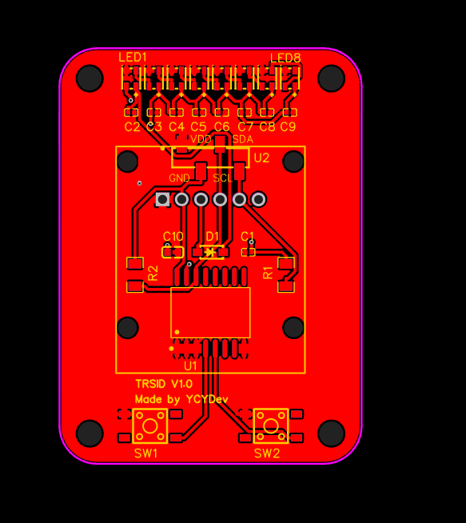
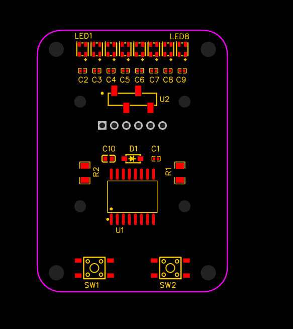
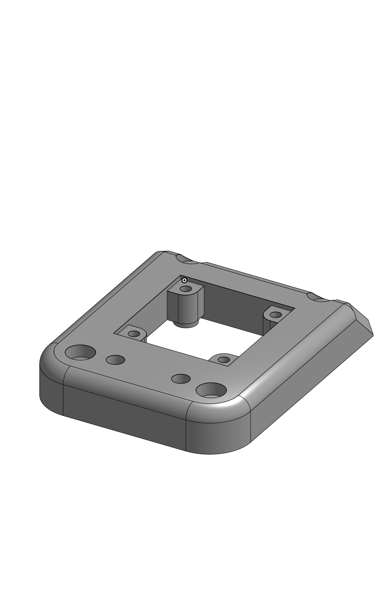
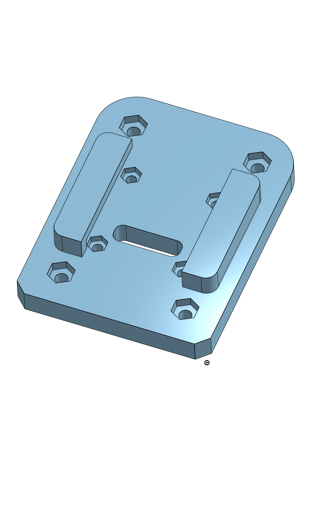
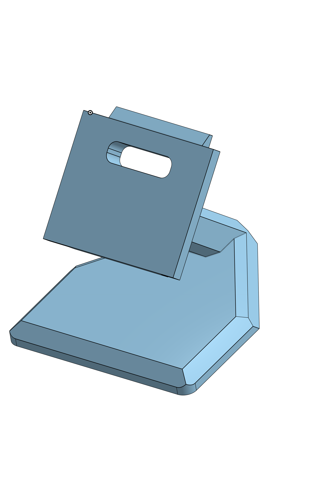
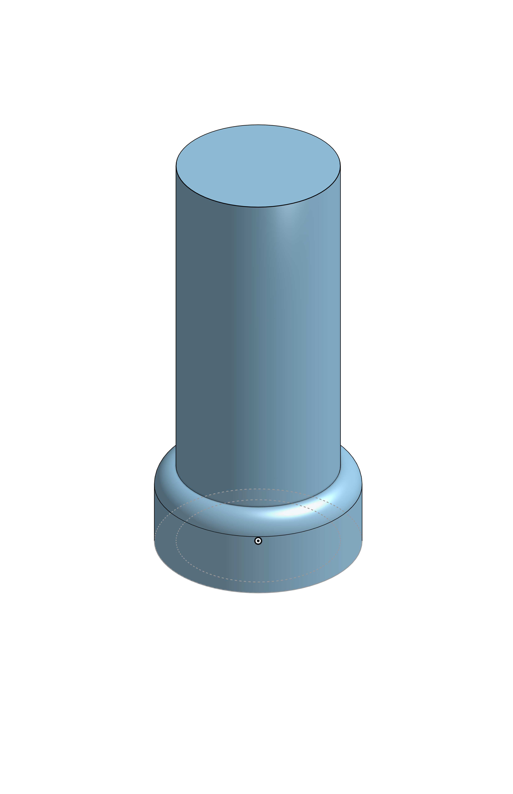
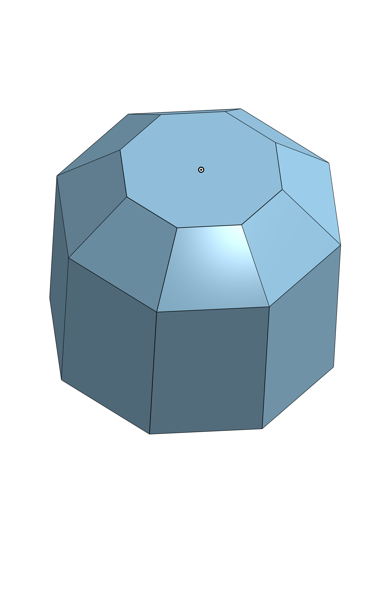

# TRSID
Tiny Raspi System information display

## Description
This project is a tiny system information display for a Raspberry Pi.
It is powered by a WS2812 LED strip and a tiny OLED display. The system information is displayed on the OLED screen, while the LED strip provides a visual representation of the system's status.

## Features
- Displays CPU usage, memory usage, and disk usage on the OLED screen.
- Uses the WS2812 LED strip to indicate system status with different colors.
- Auto-sleep (software) when the system is idle for a certain period of time.
- Wake up by pressing a button
- Change mode by pressing a button

## PCB
The PCB is designed to be compact and efficient, with a focus on minimizing power consumption and external wiring. 

### Main components
- SSD1322 OLED display
- WS2812 LED * 8
- PCF8574 I/O expander
- Button * 2

### PCB Layout
<table>
  <tr>
    <td></td>
    <td></td>
  </tr>
</table>

## Cad for 3D printing
The case for the TRSID is designed to be 3D printed. The design is simple and functional, with a focus on protecting the components while allowing easy access to the display and buttons.
### 3D Model
3D models are separately designed for the top, bottom, and support parts of the case. The top part includes cutouts for the OLED display, buttons and thin shell for the WS2812 LED strip. It also designs as housing for the PCB. The bottom part is designed to be a simple cover the top part and has a connection track for the support part. The support part is designed to make the top and bottom parts stand at a 45-degree angle, providing better visibility of the display and easier access to the buttons.

<table>
    <tr>
        <td>Top Part</td>
        <td>Bottom Part</td>
        <td>Support Part</td>
    </tr>
    <tr>
        <td></td>
        <td></td>
        <td></td>
    </tr>
    <tr>
        <td>Button extension</td>
        <td>button extension hat</td>
        <td></td>
    </tr>
     <tr>
        <td></td>
        <td></td>
        <td></td>
    </tr>
</table>

### Screws and Hex Nuts

<table>
    <thead>
        <tr>
            <th>Type</th>
            <th>Length</th>
            <th>Quantity</th>
        </tr>
    </thead>
    <tbody>
        <tr>
            <td>M3 Screw</td>
            <td>14mm</td>
            <td>4</td>
        </tr>
        <tr>
            <td>M3 Hex Nut</td>
            <td>N/A</td>
            <td>4</td>
        </tr>
        <tr>
            <td>M2 Screw</td>
            <td>16mm</td>
            <td>4</td>
        </tr>
        <tr>
            <td>M2 Hex Nut</td>
            <td>N/A</td>
            <td>4</td>
        </tr>
    </tbody>
</table>

## Code
The code for the TRSID is written in Python and is designed to run on a Raspberry Pi. It uses the `rpi_ws281x` library to control the WS2812 LED strip and the `Adafruit_SSD1322` library to control the OLED display. The code is structured to allow for easy updates and modifications, with clear separation between the different components of the system.

### Part code
- [ws2812.py](./code/part/ws2812.py): Code for controlling the WS2812 LED strip.
- [ssd1306oled.py](./code/part/ssd1306oled.py): Code for controlling the OLED display.
- [pcf8574.py](./code/part/pcf8574.py): Code for handling button inputs.

### Main code
- [main.py](./code/main.py): Main code that integrates all components and implements the system information display functionality.